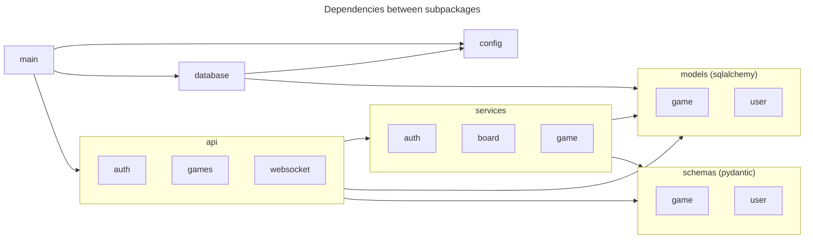

# Review of Experiment AIAC-V0

## Overview

* Game adaptations seem reasonable, from the name of buildings to the name of resources.
* The code didn't work out of the box, there were errors launching both frontend and backend.
* Folder structure, classes and functions sound reasonable.
* Quality checks not created (e.g. mypy, ruff, tests).
* Created some linkes to non existing files, to LICENSE and Contributing Guidelines specifically.
* Added instruction with missing file (cp .env.exapmle .env)


## Code review


### Backend

The agent created an architecture that with the following folder structure and dependencies:

```
backend/
└── app/
    ├── api/
    ├── services/
    ├── models/
    ├── schemas/
    └── main.py
```



I don't think the design is bad, it is something common to find in the industry. Moreover, the design makes much of the code testable, because the pieces that require external resources are injected, as in the case of the [AuthService.get_user_by_username method](https://github.com/srcolinas/AIAC-V0/blob/6a64c41dbb394288ac7e851f73b3b8e92a267a6d/backend/app/services/auth.py#L58). Moreover, I like the fact that the routers are exposed through the [api module](https://github.com/srcolinas/AIAC-V0/blob/6a64c41dbb394288ac7e851f73b3b8e92a267a6d/backend/app/api/__init__.py#L6), making it easier to [import in the main file](https://github.com/srcolinas/AIAC-V0/blob/6a64c41dbb394288ac7e851f73b3b8e92a267a6d/backend/app/main.py#L16).


In addition, the code to handle user requests seem reasonable, like the [login](https://github.com/srcolinas/AIAC-V0/blob/6a64c41dbb394288ac7e851f73b3b8e92a267a6d/backend/app/api/auth.py#L45) and [registration](https://github.com/srcolinas/AIAC-V0/blob/6a64c41dbb394288ac7e851f73b3b8e92a267a6d/backend/app/api/auth.py#L15) handlers (assuming the authentication service has a correct implementation). Other handlers seem reasonable as well. Whether they are correct or not is a completely different question, it would require me to test the code and I am avoiding that effort for now. Just keep in mind that the code overall doesn't work. 

Regarding coding style or quality, I found the following issues:

* Duplicated [import inside function definition](https://github.com/srcolinas/AIAC-V0/blob/6a64c41dbb394288ac7e851f73b3b8e92a267a6d/backend/app/api/auth.py#L95), given that the same class was [imported at the top of the module](https://github.com/srcolinas/AIAC-V0/blob/6a64c41dbb394288ac7e851f73b3b8e92a267a6d/backend/app/api/auth.py#L9). 


* The [AuthService](https://github.com/srcolinas/AIAC-V0/blob/6a64c41dbb394288ac7e851f73b3b8e92a267a6d/backend/app/services/auth.py#L17), [BoardGenerator](https://github.com/srcolinas/AIAC-V0/blob/6a64c41dbb394288ac7e851f73b3b8e92a267a6d/backend/app/services/board.py#L7) and [GameService](https://github.com/srcolinas/AIAC-V0/blob/6a64c41dbb394288ac7e851f73b3b8e92a267a6d/backend/app/services/game.py#L41) classes are full of only static methods or class methods, but I don't find any consistency in its use and it seems simpler to me to use just plain functions, as those clases clearly do not have any state involved. 

* Checks against enums are done using == instead of is, which I find more convenient, (see example [here](https://github.com/srcolinas/AIAC-V0/blob/6a64c41dbb394288ac7e851f73b3b8e92a267a6d/backend/app/api/auth.py#L122)).

* Long try except blocks with no clear separation of what piece of code may cause the exception (see [here](https://github.com/srcolinas/AIAC-V0/blob/6a64c41dbb394288ac7e851f73b3b8e92a267a6d/backend/app/api/websocket.py#L84-L156))

* Functions created that are not used (see [here](https://github.com/srcolinas/AIAC-V0/blob/6a64c41dbb394288ac7e851f73b3b8e92a267a6d/backend/app/api/websocket.py#L159))

* Some settings are not used anywhere in the code (e.g. [here](https://github.com/srcolinas/AIAC-V0/blob/6a64c41dbb394288ac7e851f73b3b8e92a267a6d/backend/app/config.py#L18-L20))


## Frontend

Pending...

## AI Client

Again, the instructions to execute don't work, even the step to install dependencies fails due to a conflict with package version:

```
ERROR: Cannot install httpx==0.26.0 and pydantic-ai-slim because these package versions have conflicting dependencies.
```


